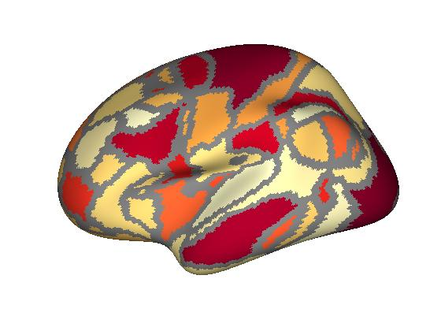
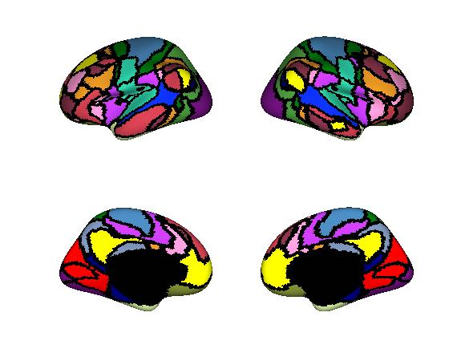

# plotFSurf
simple surface viz for neuroimaging

These tools are for plotting your data on a FreeSurfer surface. These tools are meant to be quite simple, so as to be easily-editable. The surface visualization uses MATLAB's [trisurf](https://www.mathworks.com/help/matlab/ref/trisurf.html) function. With these scripts, we can plot on any FreeSurfer surface with any parcellation on that surface. The surface needs to be converted to ascii-format, which can be done using the provided script in the ``src/external`` dir, which uses FreeSurfer's [mris_convert](https://surfer.nmr.mgh.harvard.edu/fswiki/mris_convert) function. 

Take a look at the ``plotSurf_example.m`` for a quick plotting recipe using the example data provided!

These scripts were adapted from code provided by [Makoto Fukushima](https://sites.google.com/site/mfukushimaweb/home). 

 This material is based upon work supported by the National Science Foundation Graduate Research Fellowship under Grant No. 1342962. Any opinion, findings, and conclusions or recommendations expressed in this material are those of the authors(s) and do not necessarily reflect the views of the National Science Foundation. 
